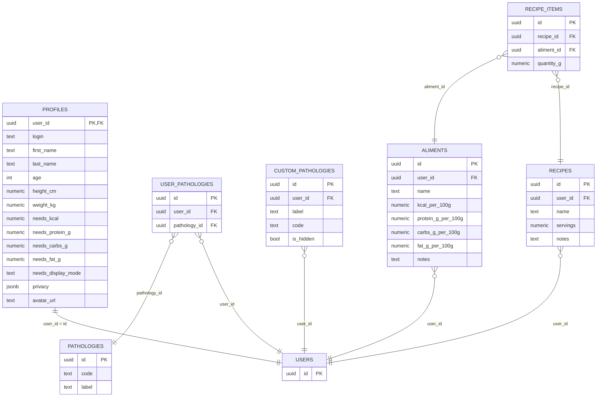

# Cahier des charges — NutriSanté+

Version: 1.1 • Date: 2025-08-17

Changements v1.1
- Ajout d’un schéma SQL consolidé (DDL global) — section 14.
- Ajout d’un ERD (diagramme entités‑relations) simplifié — section 15.
- Ajout d’une matrice de suivi (checklist par fonctionnalité) — section 16.

Ce document décrit le périmètre fonctionnel, l’architecture, la sécurité, l’état d’avancement et les procédures d’exécution/déploiement de l’application NutriSanté+. Il sert de référence pour l’équipe produit et les développeurs.

## 1. Vision et objectifs

- Aider un utilisateur à gérer son profil santé et ses objectifs (kcal/macros), construire un référentiel d’aliments, créer des recettes et, à terme, suivre des mesures (poids/IMC), planifier ses repas, produire une liste de courses et visualiser des statistiques.
- Respecter la confidentialité: données isolées par utilisateur (RLS), stockage privé pour les avatars, granularité de confidentialité au niveau de certains champs profil (masquée en UI à l’instant T mais supportée côté données).

## 2. Périmètre fonctionnel (exigences)

### 2.1 Authentification et accès
- Connexion email/mot de passe (via la plateforme backend).
- Inscription sans confirmation email (auto-login après sign-up).
- Réinitialisation de mot de passe (demande par email et changement après lien).
- Garde de routes: `/profil`, `/aliments`, `/recettes`, etc. sont protégées; redirection avec `returnTo` après login.
- Menu utilisateur (en‑tête): affiche l’email/nom, lien vers `/profil`, déconnexion.

État: Fait (Étapes 11–14).

### 2.2 Profil
- Bloc Compte (lecture seule): Email/Login, ID utilisateur, date de création.
- Avatar (stockage privé): téléversement, suppression, URL signée pour affichage; aperçu agrandi au survol; boutons en icônes (Upload/Trash).
- Formulaire Profil (édition):
  - Prénom, NOM (rendu uppercase visuel), Âge, Taille (cm), Poids (kg).
  - IMC calculé côté client: affiché en lecture seule + pastille colorée avec libellé (“Sous‑poids”, “Normal”, “Surpoids”, “Obèse”).
  - Besoins (kcal/j) et mode d’affichage des objectifs (valeurs absolues ou pourcentages).
  - Objectifs macros: Protéines/Glucides/Lipides (g/j).
  - Confidentialité par champ (structure persistée); UI des cadenas volontairement masquée à l’instant T.
  - “Identifiant / login”: champ masqué en UI (logique conservée côté data).
- Confirmation avant enregistrement; toasts en FR.

État: Fait (Étapes 19.C, 19.1, 19.D, 19.2).

### 2.3 Pathologies (défaut et personnelles)
- Référentiel « défaut » par application + sélection par l’utilisateur (liste avec checkboxes).
- Pathologies personnelles de l’utilisateur: ajout/suppression, visibilité (is_hidden) avec affichage Actif/Inactif et grisé si inactif.
- Anti‑doublon: si l’utilisateur ajoute un label déjà existant (comparaison insensible à la casse), réactivation de l’existant au lieu de créer un doublon.
- Déduplication visuelle: si une pathologie « défaut » est sélectionnée par l’utilisateur, l’étiquette personnelle identique est masquée côté UI.
- Administration (pour rôle admin):
  - Promouvoir une personnelle en « défaut » (publique) et inversement (déclasser défaut → personnel) avec validations.
  - Suppression d’une pathologie « défaut » avec fallback RPC sécurisé en cas de blocage RLS.

État: Fait (Étapes 19.1 et 19.D).

### 2.4 Aliments
- Table personnelle d’aliments (RLS par utilisateur) avec: nom, macros pour 100g, notes.
- Liste triée par nom; CRUD.
- V2: recherche (texte), filtres min/max (kcal, prot, gluc, lip), tri, pagination, synchronisation d’URL.

État: Fait (Étapes 16–17).

### 2.5 Recettes
- Modèle Recettes + Ingrédients de recette (RLS par utilisateur).
- UI: liste des recettes, création/édition, gestion d’ingrédients (lien vers aliments), totaux nutritionnels et par portion calculés en direct.

État: Fait (Étape 18).

### 2.6 Suivi médical (planifié)
- V1 (à venir 20.1): table de mesures (poids/IMC, notes, datation), hooks côté client, UI de saisie rapide, mini‑stats/graphiques.

État: À faire (Étape 20.1).

### 2.7 Planification, Courses, Statistiques (planifié)
- Planification des repas v2 (20.2), Liste de courses v1 (20.3), Statistiques v1 (20.4).

État: À faire (Roadmap 20.x).

## 3. Contraintes non fonctionnelles
- Sécurité: RLS sur toutes les tables applicatives; bucket Storage « avatars » privé; RPC sensible limité à l’admin/service role.
- Performance: requêtes paginées sur listes volumineuses; cache et invalidations côté client.
- UX: composants UI cohérents; responsive mobile→desktop; toasts FR; confirmations avant opérations sensibles.
- Accessibilité: textes alternatifs pour avatars; boutons icônes avec `title`/éléments `sr-only`.
- Localisation: libellés et toasts en français.

## 4. Modèle de données (résumé conceptuel)
- Profils: user_id, login, first_name, last_name, age, height_cm, weight_kg, needs_kcal, needs_protein_g, needs_carbs_g, needs_fat_g, needs_display_mode, privacy, avatar_url.
- Pathologies (défaut): id, code (optionnel), label.
- user_pathologies: relation utilisateur ↔ pathologies « défaut » sélectionnées.
- custom_pathologies (perso): id, user_id, label, code (optionnel), is_hidden (visibilité).
- Aliments: id, user_id, name, kcal_per_100g, protein_g_per_100g, carbs_g_per_100g, fat_g_per_100g, notes.
- Recettes: recipes(id, user_id, name, servings, notes…), recipe_items(recipe_id, aliment_id, quantity_g…).

Notes:
- Contraintes: unicité pertinente (ex: aliments par (user_id, name)), indexes usuels, triggers `updated_at`.
- Confidentialité: structure `privacy` stockée côté profil; UI masquée pour l’instant.

## 5. Architecture logicielle
- SPA Vite/React/TypeScript.
- UI: Tailwind + composants headless (Radix via bibliothèque UI), icônes.
- Data: client JS vers le backend, cache côté client, formulaires typés/validés.
- Stockage avatars: bucket privé avec dossiers par utilisateur; accès via URL signées.
- Fallback RPC pour opérations d’administration incompatibles avec RLS strictes (limité et sécurisé).

## 6. Sécurité et politiques (RLS/Storage)
- RLS activée: chaque table applicative restreinte à l’utilisateur connecté.
- Storage: bucket privé `avatars`; policy « un utilisateur gère son propre dossier <uid>/ ».
- RPC sensible: exécution via rôle de service ou canal d’administration uniquement.

## 7. Parcours et UI clés
- Profil
  - En‑tête aligné: « Compte » (2/3) + « Avatar » (1/3). Avatar: upload, suppression, aperçu au survol.
  - Grilles responsives: Prénom/NOM; Âge/Taille/Poids/IMC; Besoins/Mode; Prot/Gluc/Lip.
  - IMC: input compact (lecture seule) + pastille colorée (Sous‑poids/Normal/Surpoids/Obèse).
  - Confidentialité: section masquée en UI (fonctionnalité conservée côté données/sauvegarde).
- Pathologies: badges des sélectionnées; liste « défaut » (checkbox); personnelles (Actif/Inactif, grisé si inactif); admin (promouvoir/déclasser/supprimer) avec icônes.
- Aliments: recherche/filtres/tri/pagination + CRUD.
- Recettes: liste + éditeur d’ingrédients, totaux et par portion.

## 8. Mise en place — Exécution locale

Prérequis
- Node.js LTS (18+ conseillé).
- Compte et projet backend configurés (base + storage).

Variables d’environnement (fichier `.env.local` à la racine)
```bash
VITE_SUPABASE_URL=your-supabase-url
VITE_SUPABASE_ANON_KEY=your-public-anon-key
# Clé service role facultative pour scripts Node (non utilisée côté client)
SUPABASE_SERVICE_ROLE=your-service-role-key
```

Étapes
1) Installer les dépendances
```powershell
npm install
```
2) Configurer le backend
- Appliquer les scripts SQL (tables, RLS pour aliments/recettes/profils/pathologies, RPC admin si requis).
- Créer le bucket privé « avatars » et sa policy.
- (Optionnel) Seed d’un utilisateur admin via le script fourni.
3) Démarrer en développement
```powershell
npm run dev
```
4) Build de production (facultatif)
```powershell
npm run build
```

## 9. Déploiement (en ligne)

Hébergement applicatif (ex: Vercel/Netlify)
- Définir les variables d’environnement `VITE_SUPABASE_URL` et `VITE_SUPABASE_ANON_KEY` dans le provider.
- Construire via `npm run build`; servir le dossier `dist/`.

Backend managé
- Créer un projet dédié (prod) et réappliquer les scripts SQL (tables/RLS/policies) identiques à l’environnement local.
- Créer le bucket `avatars` (privé) et sa policy.
- Restreindre l’exécution des RPC sensibles aux rôles adéquats (ou utilisation service role côté scripts d’admin).

Domaines et sécurité
- Forcer HTTPS côté hébergeur; vérifier CORS et settings (URL du site approuvée si nécessaire).

## 10. État d’avancement (instant T)

- Auth (login/register/reset): Fait
- Routes protégées + returnTo: Fait
- Profil (formulaire + IMC + besoins/macros): Fait
- Avatar (upload/suppression, aperçu hover, icônes): Fait
- Confidentialité par champ (données): Fait; UI: Masquée
- Pathologies défaut + personnelles (réactivation doublon, is_hidden, admin promote/demote/delete + fallback RPC): Fait
- Aliments (CRUD + recherche/tri/pagination/URL): Fait
- Recettes (schema + data + UI + totaux/per-portion): Fait
- Suivi médical v1: À faire (20.1)
- Planification v2 / Courses v1 / Stats v1: À faire (20.2–20.4)

Qualité
- Build: PASS (vite). Avertissements de taille de bundle possibles (>500 kB).
- TypeScript: PASS.
- Tests: principalement smoke tests manuels. Pas de CI/CD configurée.

## 11. Critères d’acceptation (exemples)
- Profil: sauvegarde réussie, IMC recalculé en direct, pastille correcte selon la valeur.
- Pathologies: ajout d’un doublon → réactivation; bascule Actif/Inactif visible; sélection défaut/perso sans doublon visuel.
- Aliments: création avec validation, filtres et tri appliqués, pagination stable.
- Recettes: ajout/suppression d’un ingrédient, recalcul des totaux et par portion instantané.
- Avatar: upload et suppression effectifs, URL signée valide, aperçu hover fonctionnel.

## 12. Risques et dettes
- Aucune CI automatisée (tests/linters) — à prévoir.
- Avertissements de taille de bundle — à optimiser ultérieurement (code splitting, manualChunks).
- La fonctionnalité « Confidentialité » est supportée côté data mais masquée en UI — synchroniser les attentes produit.

## 13. Roadmap de référence (20.x)
- 20.1 — Suivi médical v1 (mesures + mini‑stats)
- 20.2 — Planification repas v2
- 20.3 — Liste de courses v1
- 20.4 — Statistiques v1

---

Contact: confier ce CDC au dev référent avant itération; les sections 8–9 doivent être exécutées dans l’ordre. Se référer au README pour d’éventuels détails SQL.

## 14. Schéma SQL consolidé (DDL global — exemple à adapter)

Fichier exécutable: `scripts/schema.sql` (export consolidé et idempotent).

Note: Ce DDL est idempotent et peut être adapté aux écarts éventuels de schéma existant. Les politiques RLS supposent l’usage de `auth.uid()`.

```sql
-- Extensions nécessaires (Supabase fournit déjà pgcrypto/gen_random_uuid)
create extension if not exists pgcrypto;

-- 14.1 Profils
create table if not exists public.profiles (
  user_id uuid primary key references auth.users(id) on delete cascade,
  login text unique,
  first_name text,
  last_name text,
  age int,
  height_cm numeric(10,2),
  weight_kg numeric(10,2),
  needs_kcal numeric(10,2),
  needs_protein_g numeric(10,2),
  needs_carbs_g numeric(10,2),
  needs_fat_g numeric(10,2),
  needs_display_mode text check (needs_display_mode in ('absolute','percent')) default 'absolute',
  privacy jsonb,
  avatar_url text,
  created_at timestamptz not null default now(),
  updated_at timestamptz not null default now()
);

create or replace function public.set_updated_at() returns trigger language plpgsql as $$
begin new.updated_at = now(); return new; end $$;
drop trigger if exists set_profiles_updated_at on public.profiles;
create trigger set_profiles_updated_at before update on public.profiles
for each row execute function public.set_updated_at();

alter table public.profiles enable row level security;
do $$ begin
  if not exists (select 1 from pg_policies where schemaname='public' and tablename='profiles' and policyname='profiles_select_own') then
    create policy profiles_select_own on public.profiles for select using (auth.uid() = user_id);
  end if;
  if not exists (select 1 from pg_policies where schemaname='public' and tablename='profiles' and policyname='profiles_upsert_own') then
    create policy profiles_upsert_own on public.profiles for all using (auth.uid() = user_id) with check (auth.uid() = user_id);
  end if;
end $$;

-- 14.2 Pathologies (défaut) et relations
create table if not exists public.pathologies (
  id uuid primary key default gen_random_uuid(),
  code text,
  label text not null,
  created_at timestamptz not null default now(),
  updated_at timestamptz not null default now()
);

drop trigger if exists set_pathologies_updated_at on public.pathologies;
create trigger set_pathologies_updated_at before update on public.pathologies
for each row execute function public.set_updated_at();

-- Sélection publique en lecture (si souhaité); sinon restreindre aux admins via RPC
alter table public.pathologies enable row level security;
do $$ begin
  if not exists (select 1 from pg_policies where schemaname='public' and tablename='pathologies' and policyname='pathologies_select_all') then
    create policy pathologies_select_all on public.pathologies for select using (true);
  end if;
end $$;

-- Lien user ↔ pathologies « défaut » sélectionnées
create table if not exists public.user_pathologies (
  id uuid primary key default gen_random_uuid(),
  user_id uuid not null references auth.users(id) on delete cascade,
  pathology_id uuid not null references public.pathologies(id) on delete cascade,
  created_at timestamptz not null default now()
);

create index if not exists user_pathologies_user_idx on public.user_pathologies(user_id);
create unique index if not exists user_pathologies_uniq on public.user_pathologies(user_id, pathology_id);

alter table public.user_pathologies enable row level security;
do $$ begin
  if not exists (select 1 from pg_policies where schemaname='public' and tablename='user_pathologies' and policyname='user_pathologies_select_own') then
    create policy user_pathologies_select_own on public.user_pathologies for select using (auth.uid() = user_id);
  end if;
  if not exists (select 1 from pg_policies where schemaname='public' and tablename='user_pathologies' and policyname='user_pathologies_ins_own') then
    create policy user_pathologies_ins_own on public.user_pathologies for insert with check (auth.uid() = user_id);
  end if;
  if not exists (select 1 from pg_policies where schemaname='public' and tablename='user_pathologies' and policyname='user_pathologies_del_own') then
    create policy user_pathologies_del_own on public.user_pathologies for delete using (auth.uid() = user_id);
  end if;
end $$;

-- Pathologies personnelles
create table if not exists public.custom_pathologies (
  id uuid primary key default gen_random_uuid(),
  user_id uuid not null references auth.users(id) on delete cascade,
  label text not null,
  code text,
  is_hidden boolean not null default false,
  created_at timestamptz not null default now(),
  updated_at timestamptz not null default now()
);

create unique index if not exists custom_pathologies_label_ci_uniq on public.custom_pathologies(user_id, lower(label));

drop trigger if exists set_custom_pathologies_updated_at on public.custom_pathologies;
create trigger set_custom_pathologies_updated_at before update on public.custom_pathologies
for each row execute function public.set_updated_at();

alter table public.custom_pathologies enable row level security;
do $$ begin
  if not exists (select 1 from pg_policies where schemaname='public' and tablename='custom_pathologies' and policyname='custom_pathologies_select_own') then
    create policy custom_pathologies_select_own on public.custom_pathologies for select using (auth.uid() = user_id);
  end if;
  if not exists (select 1 from pg_policies where schemaname='public' and tablename='custom_pathologies' and policyname='custom_pathologies_cud_own') then
    create policy custom_pathologies_cud_own on public.custom_pathologies for all using (auth.uid() = user_id) with check (auth.uid() = user_id);
  end if;
end $$;

-- 14.3 Aliments
create table if not exists public.aliments (
  id uuid primary key default gen_random_uuid(),
  user_id uuid not null references auth.users(id) on delete cascade,
  name text not null,
  kcal_per_100g numeric(10,2) not null default 0,
  protein_g_per_100g numeric(10,2) not null default 0,
  carbs_g_per_100g numeric(10,2) not null default 0,
  fat_g_per_100g numeric(10,2) not null default 0,
  notes text,
  created_at timestamptz not null default now(),
  updated_at timestamptz not null default now()
);

create index if not exists aliments_user_id_idx on public.aliments(user_id);
create unique index if not exists aliments_user_name_uniq on public.aliments(user_id, name);

drop trigger if exists set_aliments_updated_at on public.aliments;
create trigger set_aliments_updated_at before update on public.aliments
for each row execute function public.set_updated_at();

alter table public.aliments enable row level security;
do $$ begin
  if not exists (select 1 from pg_policies where schemaname='public' and tablename='aliments' and policyname='aliments_select_own') then
    create policy aliments_select_own on public.aliments for select using (auth.uid() = user_id);
  end if;
  if not exists (select 1 from pg_policies where schemaname='public' and tablename='aliments' and policyname='aliments_insert_own') then
    create policy aliments_insert_own on public.aliments for insert with check (auth.uid() = user_id);
  end if;
  if not exists (select 1 from pg_policies where schemaname='public' and tablename='aliments' and policyname='aliments_update_own') then
    create policy aliments_update_own on public.aliments for update using (auth.uid() = user_id);
  end if;
  if not exists (select 1 from pg_policies where schemaname='public' and tablename='aliments' and policyname='aliments_delete_own') then
    create policy aliments_delete_own on public.aliments for delete using (auth.uid() = user_id);
  end if;
end $$;

-- 14.4 Recettes et ingrédients
create table if not exists public.recipes (
  id uuid primary key default gen_random_uuid(),
  user_id uuid not null references auth.users(id) on delete cascade,
  name text not null,
  servings numeric(10,2) not null default 1,
  notes text,
  created_at timestamptz not null default now(),
  updated_at timestamptz not null default now()
);

create index if not exists recipes_user_id_idx on public.recipes(user_id);
create unique index if not exists recipes_user_name_uniq on public.recipes(user_id, name);

drop trigger if exists set_recipes_updated_at on public.recipes;
create trigger set_recipes_updated_at before update on public.recipes
for each row execute function public.set_updated_at();

alter table public.recipes enable row level security;
do $$ begin
  if not exists (select 1 from pg_policies where schemaname='public' and tablename='recipes' and policyname='recipes_select_own') then
    create policy recipes_select_own on public.recipes for select using (auth.uid() = user_id);
  end if;
  if not exists (select 1 from pg_policies where schemaname='public' and tablename='recipes' and policyname='recipes_insert_own') then
    create policy recipes_insert_own on public.recipes for insert with check (auth.uid() = user_id);
  end if;
  if not exists (select 1 from pg_policies where schemaname='public' and tablename='recipes' and policyname='recipes_update_own') then
    create policy recipes_update_own on public.recipes for update using (auth.uid() = user_id);
  end if;
  if not exists (select 1 from pg_policies where schemaname='public' and tablename='recipes' and policyname='recipes_delete_own') then
    create policy recipes_delete_own on public.recipes for delete using (auth.uid() = user_id);
  end if;
end $$;

create table if not exists public.recipe_items (
  id uuid primary key default gen_random_uuid(),
  recipe_id uuid not null references public.recipes(id) on delete cascade,
  aliment_id uuid not null references public.aliments(id) on delete cascade,
  quantity_g numeric(10,2) not null default 0,
  created_at timestamptz not null default now(),
  updated_at timestamptz not null default now()
);

create index if not exists recipe_items_recipe_id_idx on public.recipe_items(recipe_id);
create index if not exists recipe_items_aliment_id_idx on public.recipe_items(aliment_id);
create unique index if not exists recipe_items_uniq on public.recipe_items(recipe_id, aliment_id);

drop trigger if exists set_recipe_items_updated_at on public.recipe_items;
create trigger set_recipe_items_updated_at before update on public.recipe_items
for each row execute function public.set_updated_at();

alter table public.recipe_items enable row level security;
do $$ begin
  if not exists (select 1 from pg_policies where schemaname='public' and tablename='recipe_items' and policyname='recipe_items_select_own') then
    create policy recipe_items_select_own on public.recipe_items
      for select using (exists (select 1 from public.recipes r where r.id = recipe_items.recipe_id and r.user_id = auth.uid()));
  end if;
  if not exists (select 1 from pg_policies where schemaname='public' and tablename='recipe_items' and policyname='recipe_items_insert_own') then
    create policy recipe_items_insert_own on public.recipe_items
      for insert with check (exists (select 1 from public.recipes r where r.id = recipe_items.recipe_id and r.user_id = auth.uid()));
  end if;
  if not exists (select 1 from pg_policies where schemaname='public' and tablename='recipe_items' and policyname='recipe_items_update_own') then
    create policy recipe_items_update_own on public.recipe_items
      for update using (exists (select 1 from public.recipes r where r.id = recipe_items.recipe_id and r.user_id = auth.uid()));
  end if;
  if not exists (select 1 from pg_policies where schemaname='public' and tablename='recipe_items' and policyname='recipe_items_delete_own') then
    create policy recipe_items_delete_own on public.recipe_items
      for delete using (exists (select 1 from public.recipes r where r.id = recipe_items.recipe_id and r.user_id = auth.uid()));
  end if;
end $$;

-- 14.5 RPC d’admin (exemple: suppression pathologie « défaut »)
create or replace function public.delete_pathology(p_id uuid)
returns void language plpgsql security definer as $$
begin
  delete from public.pathologies where id = p_id;
end; $$;

revoke all on function public.delete_pathology(uuid) from public;
-- grant execute on function public.delete_pathology(uuid) to app_admin; -- à adapter

-- 14.6 Storage (bucket privé ‘avatars’) — à créer dans Supabase Storage
-- Créer un bucket privé `avatars`, puis une policy « un utilisateur gère son propre dossier <uid>/ »
-- Exemple de règle: path LIKE concat(auth.uid()::text, '/%')
```

## 15. ERD (diagramme entités‑relations) — simplifié

Rendu image: `docs/erd.svg` (pour relectures sans Mermaid).



Note: ERD simplifié; la table `USERS` représente `auth.users` gérée par Supabase.

## 16. Matrice de suivi (checklist)

| Fonctionnalité | Description | Statut |
|---|---|---|
| Authentification | Login/Register/Reset, routes protégées, returnTo | Fait |
| Profil | Formulaire complet, IMC live + pastille, besoins/macros, login masqué en UI | Fait |
| Avatar | Upload/Suppression, URL signée, aperçu hover, icônes | Fait |
| Confidentialité (données) | Structure `privacy` persistée (UI cadenas masquée) | Fait |
| Pathologies — défaut | Référentiel global + sélection utilisateur | Fait |
| Pathologies — personnelles | CRUD, is_hidden, réactivation ilike | Fait |
| Pathologies — admin | Promote/Démote/Supprimer + fallback RPC | Fait |
| Aliments | CRUD + recherche/filtres/tri/pagination/URL | Fait |
| Recettes | Recettes + ingrédients, totaux et par portion | Fait |
| Suivi médical v1 | Mesures poids/IMC/notes + mini‑stats | À faire |
| Planification v2 | Planning repas amélioré | À faire |
| Liste de courses v1 | Agrégation hebdo, export | À faire |
| Statistiques v1 | Graphiques apports/macros/IMC | À faire |

